<div class="tab">
  <button class="tablinks active" onclick="openTab(event, 'Overview')">Overview</button>
  <button class="tablinks" onclick="openTab(event, 'Pages')">Create</button>
  <button class="tablinks" onclick="openTab(event, 'Navigate')">Visit Site</button>
  <button class="tablinks" onclick="openTab(event, 'Clone')">Clone Site</button>
    <button class="tablinks" onclick="openTab(event, 'TextEditor')">Text Editor</button>
  <button class="tablinks" onclick="openTab(event, 'Base')">Add BaseL</button>
  <button class="tablinks" onclick="openTab(event, 'Create')">index.html</button>

  <button class="tablinks" onclick="openTab(event, 'Commit')">Commit</button>
  <button class="tablinks" onclick="openTab(event, 'Verify')">Verify</button>
  <button class="tablinks" onclick="openTab(event, 'NavigatetoSite')">View Page</button>
  
  
</div>

<div id="Overview" class="tabcontent" style="display:block" markdown="1">

Create a New Git Repository for This Course

Before we dive into the assignment for the week, I want to walk you through creating a new Git repository for use in this course. We will also turn this repository "on", as a GitHub-Pages site.

First, we will create a new repo directly on GitHub.com. We will then turn it on as a GH-Pages site. Finally, we will "clone" it to our local machine, add some necessary files, and then push those back to the remote host on GitHub.com.

1. Go to [GitHub.com](https://github.com)
2. If you are not signed in, sign in to your GitHub account
3. Find the green "New repository" button and press it.
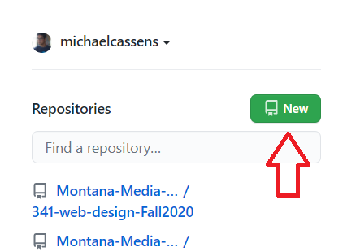
4. Give your repository a great name, like "_441_".
    - Optionally, give this repo a description, like "_Homework repo for UMontana Media Arts, Web Tech (MART441) course._".
5. Keep this as a "Public" repo.
6. Select the "Initialize this repository with a README" box.
7. Finally press the "Create Repository" button.

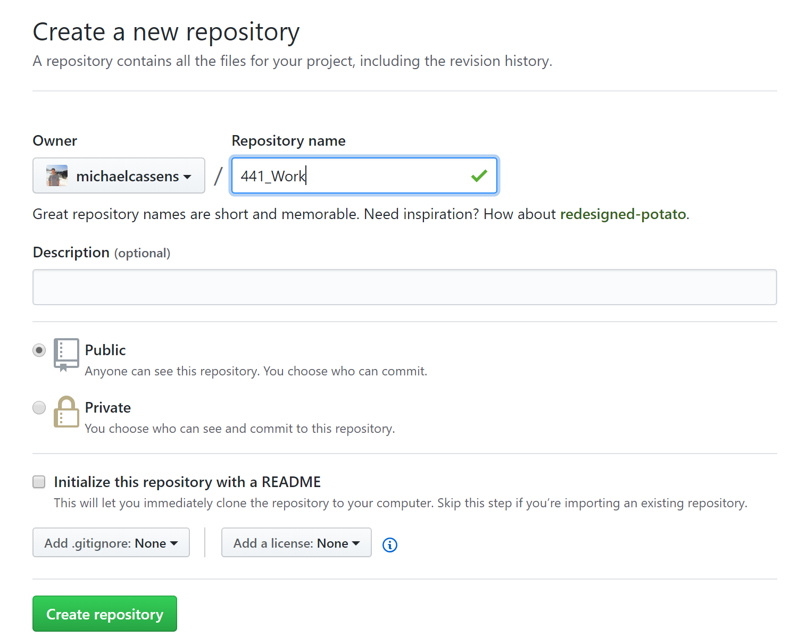


<br />

Your browser will now show you the brand new repository!

Here is another walkthrough. This might take a few seconds to load.

<iframe src="https://umontanamediaarts.com/MART341/wp-admin/admin-ajax.php?action=h5p_embed&id=10" width="748" height="665" frameborder="0" allowfullscreen="allowfullscreen"></iframe><script src="https://umontanamediaarts.com/MART341/wp-content/plugins/h5p/h5p-php-library/js/h5p-resizer.js" charset="UTF-8"></script>
</div>

<div id="Pages" class="tabcontent" markdown="1">

Turn The Repo Into a GitHub-Pages Site

To turn your repo into a GH-Pages site, you need to open the "Repository Settings".

> If you are unfamiliar with GitHub Pages, check out their [info site](https://pages.github.com)

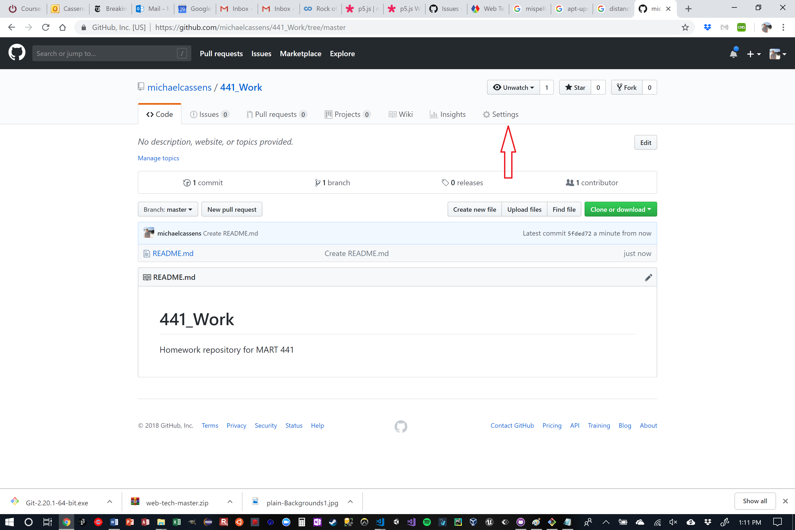

1. Inside of settings, you will need to scroll down until you fine the "GitHub Pages" section.
2. There you need to change the dropdown menu under source from "None▾" to "master branch".
3. Hit the "Save" button.
4. The page should reload and at the top, should now be a blue banner saying "GitHub Pages source saved".
5. If you scroll back down the page to the "GitHub Pages" section again,
6. You will find the URL where your site will eventually be published to.

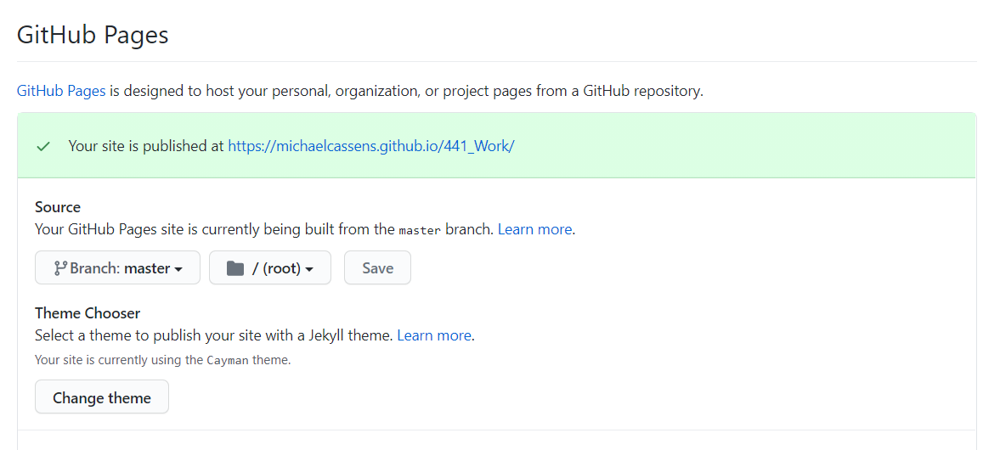
</div>
<div id="Navigate" class="tabcontent" markdown="1">

Go To Your New Site

First, wait a few moments up to a few minutes, for GitHub to "publish" your site. Then, click on the link provided from the "Settings" page. This should bring you to a static white page, displaying the contents of your README.md file.

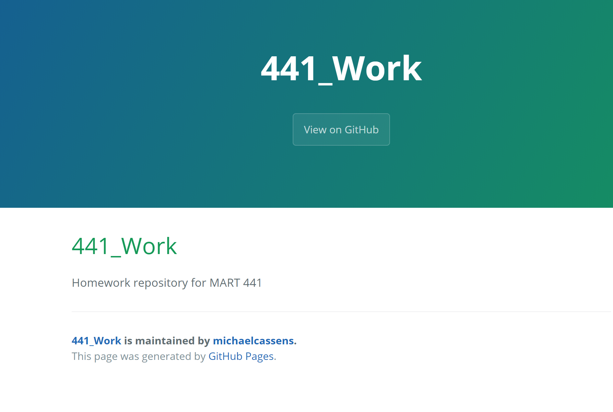

Since we have not added and pushed an index.html document yet, GitHub uses your repo's main readme instead.

</div>
<div id="Clone" class="tabcontent" markdown="1">

Clone Your New Repo

1. To clone your repository, go back to the main page of the new repo.
2. Select the "Code" button on this main page.
3. If you are using the GitHub Desktop app, then you simply need to press the "Open with GitHub Desktop" button. If instead you are using another app, copy the git URL that pops up.


#### For GitHub Desktop Users

1. After pressing "Open in Desktop" the browser should ask permission to "allow this page to open GitHub Desktop.app?"
2. Select "Allow"
3. When GitHub Desktop.app open the "Clone a Repository" window, select the "Choose..." button to navigate to a location on your system where you want this repository saved. (This is just picking a "parent" directory, not naming the directory itself.)
4. GitHub Desktop.app will suggest a directory name that is based on the repo name. Feel free to change that in the "Local Path" line to something else.
5. Finally, click "Clone".

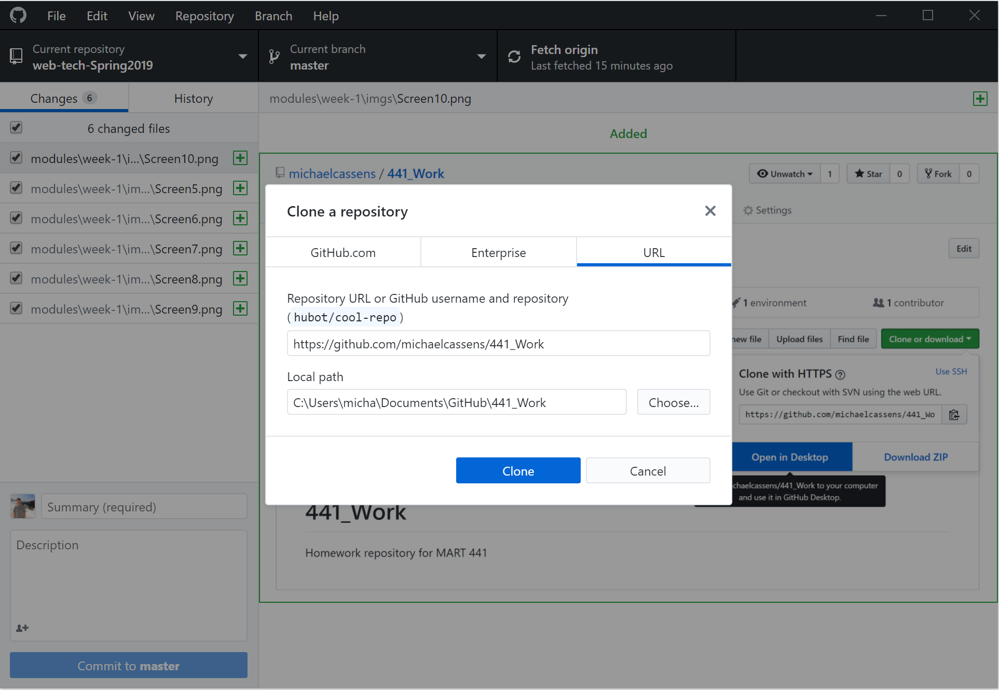

#### For Other App Users

1. In your Git client, select the appropriate "Clone Repository" option
2. Where the app asks for the Repository URL, past in the one copied from github.com.

#### For CLI Users

1. CLI (i.e. terminal) users should first navigate to the location where they want the repo saved.
2. Then use the "git clone" command to clone the repo (i.e. `git clone https://github.com/YOUR-USERNAME/YOUR-REPOSITORY.git` )

</div>
<div id="TextEditor" class="tabcontent" markdown="1">

Open The Repo Directory in your Text Editor

Finally, you should open the new local copy of the repo directory in your text editor. If you are using GitHub Desktop.app, you can select the "Open in Atom" or "Open in Visual Studio Code" option from the "Repository" dropdown menu (depending on the text editor you have installed and setup with GitHub Desktop.app)


</div>
<div id="Base" class="tabcontent" markdown="1">

Add the Base URL of Your New Site to README.md

1. Copy the URL from the repo settings that is your new sites "base url".
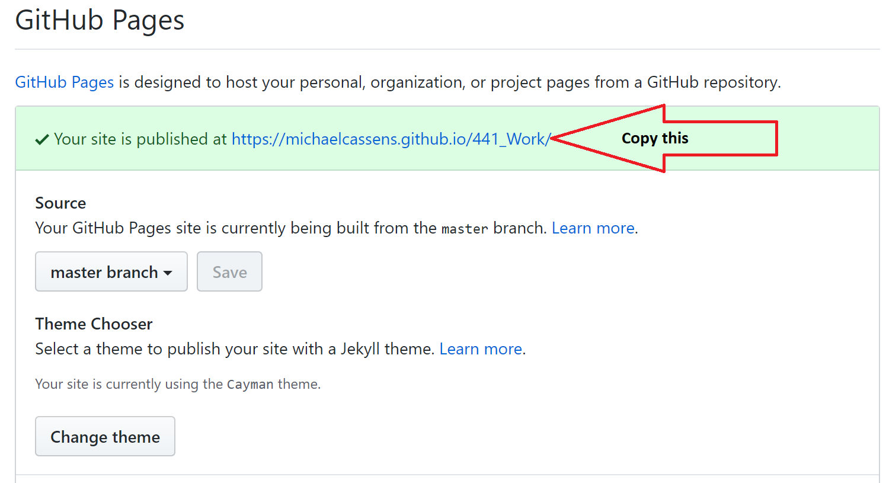

2. Paste this URL into the README.md file in your text editor. Then save this up.
    - (This could be used throughout the semester so you do not have to remember the URL)
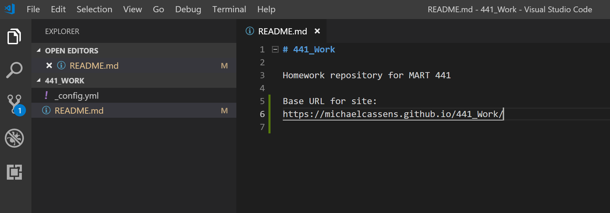

</div>
<div id="Create" class="tabcontent">
<div class="tabhtml" markdown="1">

Create a New 'index.html' File

1. In your text editor, create a new file at the top level of the repo directory, save this document as `index.html`.
2. In this document, create a basic html page with a header and paragraph that includes basic information about what this site is. Something like;

```html
<!DOCTYPE html>
<html>
    <head>
        <title>Michael's 441 Site</title>
    </head>
    <body>
        <h1>Michael's 441 Homework Site</h1>

        <p>This is the main homepage for Michael Cassens's example homework site for mart441. 
        This website is where all live examples will be located throughout the semester.</p>
    </body>
</html>
```


</div>
</div>
<div id="Commit" class="tabcontent" markdown="1">

Commit Changes and Push to GitHub.com

1. Back in GitHub Desktop.app or your Git app / CLI, stage & commit your changes to the repo.
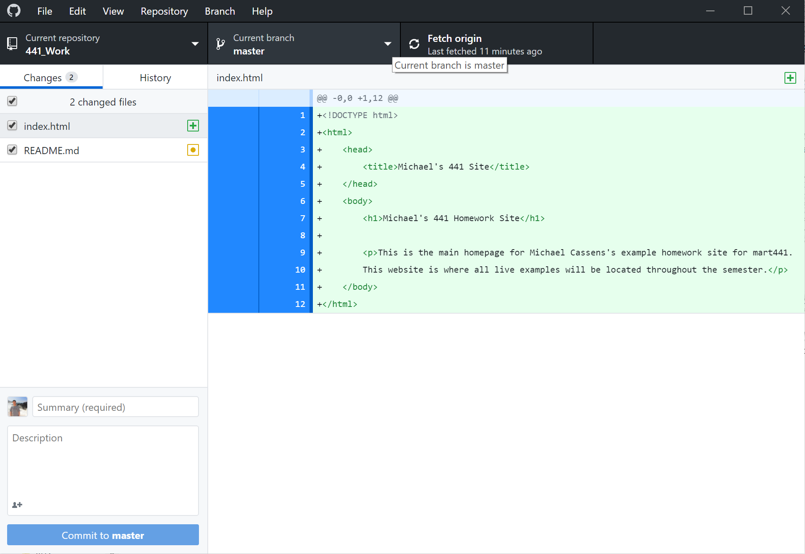

2. Next, Push your commits to the remote repository on GitHub.com, thereby sync-ing the remote and local versions of the repo.
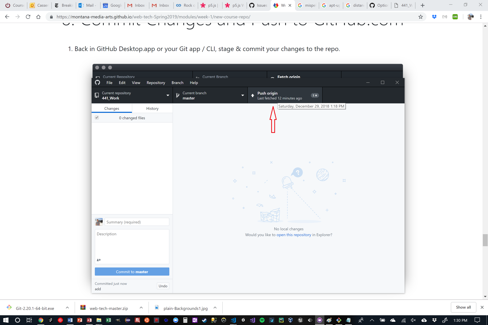

</div>

<div id="Verify" class="tabcontent" markdown="1">

Verify Sync on GitHub.com

1. In your browser, navigate back to your repository on github.com.
2. You should now see the updated README.md being displayed, as well as the existence of the 'index.html' file.
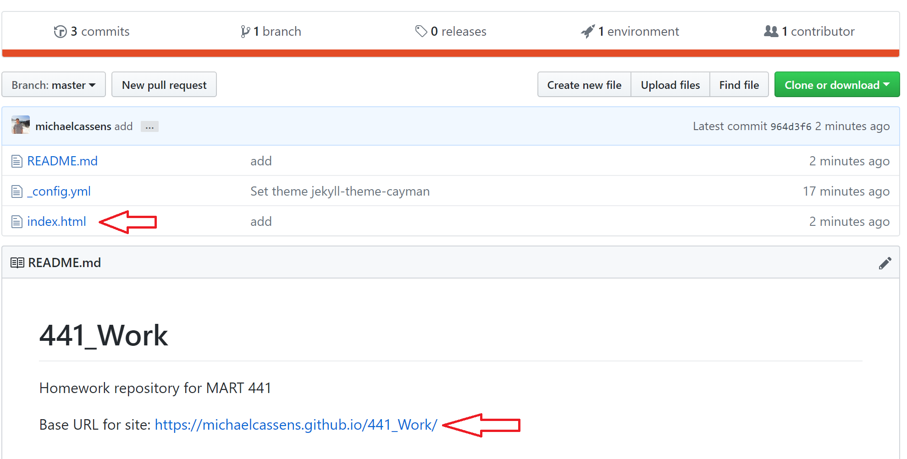
</div>
<div id="NavigatetoSite" class="tabcontent" markdown="1">

Navigate to the New Site Homepage

1. Finally, navigate back to the GH-Pages version of your site.
    - i.e. https://YOUR-USERNAME.github.io/YOUR-REPO-NAME
2. After a few minutes, GitHub should update its information, and you will see your new homepage that came from the 'index.html' document.


</div>