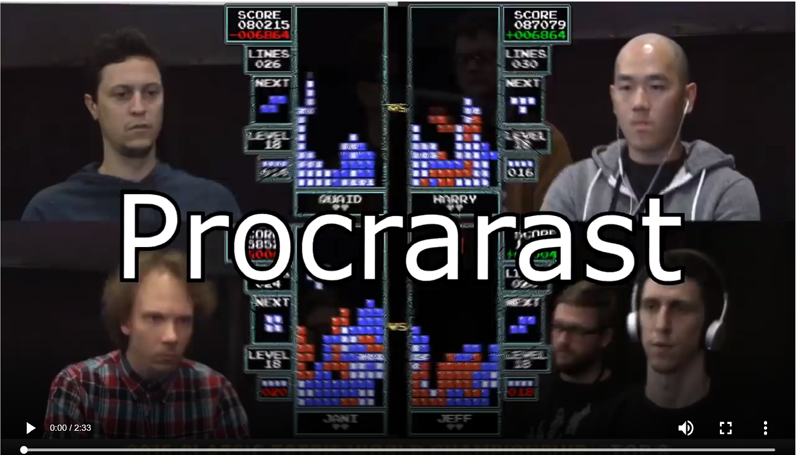
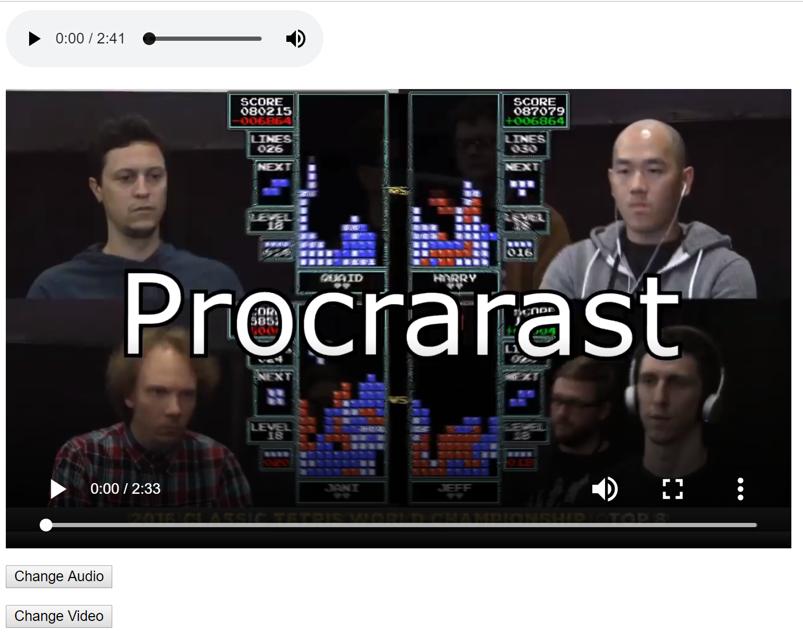

# Audio and Video

<iframe width="560" height="315" src="https://www.youtube.com/embed/pu0i31fMOpQ" frameborder="0" allow="accelerometer; autoplay; encrypted-media; gyroscope; picture-in-picture" allowfullscreen></iframe>

Two of the most exciting tag elements introduced in HTML5 is the `audio` and `video` tags.  These tags allow us to embed audio and video just as easily as when we integrated images into our sites.

For Audio, the syntax is like this:

```html
<html>
    <head>
        <title>Audio/Video</title>
    </head>
    <body>
        <audio id="song" src="https://github.com/Montana-Media-Arts/441-WebTech-Spring2020-Examples/blob/master/Week%2011/Brahms.mp3" controls="controls">
        </audio>
        <br>
    </body>
</html>
```

As you can see, the audio tag sets the src of the song and then plays the melody.  There is an attribute called **controls**, which allows the necessary controls to appear for the music player.

Similarly, the video controls work the same way.  The syntax looks like this:

```html
<html>
    <head>
        <title>Audio/Video</title>
    </head>
    <body>

        <video id="film" src="https://github.com/Montana-Media-Arts/441-WebTech-Spring2020-Examples/blob/master/Week%2011/BOOM.mp4" type="video/mp4" controls="true">
        </video>

    </body>
</html>
```


### Try it yourself!

1. Can you add your audio? 
2. Can you add your video? Find a great meme and make it appear!

**Hint** Remember you need a fully qualified URL here for an example: **https://montana-media-arts.github.io/web-tech-Spring2019/data/Brahms.mp3**

#### Screenshot




<div id="jotted-demo-1" class="jotted-theme-stacked"></div>

<script>
    new Jotted(document.querySelector("#jotted-demo-1"), {
    files: [
        {
            type: "js",
            hide: false,
            url:"https://raw.githubusercontent.com/Montana-Media-Arts/441-WebTech-Spring2020-Examples/master/Week%2011/handsonscript.js"
        },
        {
            type: "html",
            hide: false,
            url:"https://raw.githubusercontent.com/Montana-Media-Arts/441-WebTech-Spring2020-Examples/master/Week%2011/HandsOnExample.html"

    }],
    showBlank: false,
    showResult: true,
    runScripts: true,
    plugins: [
        { name: 'ace', options: { "maxLines": 100, "Lines": 100 } },
        // { name: 'console', options: { autoClear: true } },
    ]
});
</script>

Did it work? Yes? Well done!

## Change Source with Events

For audio, it looks like this:

```javascript
    var audio = document.getElementById("song");
    audio.src="https://github.com/Montana-Media-Arts/441-WebTech-Spring2020-Examples/blob/master/Week%2011/Schubert.mp3";
```

and for the video, it would like like this:

```javascript
    var film = document.getElementById("film");
    film.src="hhttps://github.com/Montana-Media-Arts/441-WebTech-Spring2020-Examples/blob/master/Week%2011/Cat.mp4";
```

So, if we put it all together now.  The HTML file would look like this:

```html
<html>
    <head>
        <title>Audio/Video</title>
        <script src="main.js"></script>
    </head>
    <body>

        <audio id="song" src="https://github.com/Montana-Media-Arts/441-WebTech-Spring2020-Examples/blob/master/Week%2011/Brahms.mp3" controls="controls">
        </audio>
        <br>
        <video id="film" src="https://github.com/Montana-Media-Arts/441-WebTech-Spring2020-Examples/blob/master/Week%2011/BOOM.mp4" type="video/mp4" controls="true">
        </video>

        <p></p>
        <button onclick="updateAudio();">Change Audio</button>

        <p></p>
        <button onclick="updateVideo();">Change Video</button>

    </body>
</html>
```

While the JavaScript file would look like this:

```javascript
function updateAudio()
{
    var audio = document.getElementById("song");
    audio.src="https://github.com/Montana-Media-Arts/441-WebTech-Spring2020-Examples/blob/master/Week%2011/Schubert.mp3";
}

function updateVideo()
{
    var film = document.getElementById("film");
    film.src="https://github.com/Montana-Media-Arts/441-WebTech-Spring2020-Examples/blob/master/Week%2011/Cat.mp44";
}
```

### Try it yourself!

1. Can you change your audio with JavaScript?
2. Can you change your video with JavaScript?

#### Screenshot




<div id="jotted-demo-2" class="jotted-theme-stacked"></div>

<script>
    new Jotted(document.querySelector("#jotted-demo-2"), {
    files: [
        {
            type: "js",
            hide: false,
            url:"https://raw.githubusercontent.com/Montana-Media-Arts/441-WebTech-Spring2020-Examples/master/Week%2011/handsonscript.js"
        },
        {
            type: "html",
            hide: false,
            url:"https://raw.githubusercontent.com/Montana-Media-Arts/441-WebTech-Spring2020-Examples/master/Week%2011/HandsOnExample.html"

    }],
    showBlank: false,
    showResult: true,
    runScripts: true,
    plugins: [
        { name: 'ace', options: { "maxLines": 100, "Lines": 100 } },
        // { name: 'console', options: { autoClear: true } },
    ]
});
</script>

Did you get it? Yes? Great work! Keep it up!

## Changes with jQuery

We can do the same thing in jQuery like this:

```javascript
$(document).ready(function(){
    $("#audiochange").click(function(){
        updateAudio();
    });

    $("#videochange").click(function(){
        updateVideo();
    });
});


function updateAudio()
{
    $("#song").attr("src", "https://github.com/Montana-Media-Arts/441-WebTech-Spring2020-Examples/blob/master/Week%2011/Schubert.mp3"); 
}

function updateVideo()
{
    $("#film").attr("src", "https://github.com/Montana-Media-Arts/441-WebTech-Spring2020-Examples/blob/master/Week%2011/Cat.mp4");
}

```

and the HTML file would look something like this:

```html
<html>
    <head>
        <title>Audio/Video</title>
        <script src="libs/jquery.min.js"></script>
        <script src="scripts/main.js"></script>
    </head>
    <body>

        <audio id="song" src="https://github.com/Montana-Media-Arts/441-WebTech-Spring2020-Examples/blob/master/Week%2011/Brahms.mp3" controls="controls">
        </audio>
        <br>
        <video id="film" src="https://github.com/Montana-Media-Arts/441-WebTech-Spring2020-Examples/blob/master/Week%2011/BOOM.mp4" type="video/mp4" controls="true">
        </video>

        <p></p>
        <button id="audiochange">Change Audio</button>

        <p></p>
        <button id="videochange">Change Video</button>

    </body>
</html>
```


### Try it yourself!

1. Can you change your audio with jQuery?
2. Can you change your video with jQuery?

#### Screenshot


<div id="jotted-demo-3" class="jotted-theme-stacked"></div>

<script>
    new Jotted(document.querySelector("#jotted-demo-3"), {
    files: [
        {
            type: "js",
            hide: false,
            url:"https://raw.githubusercontent.com/Montana-Media-Arts/441-WebTech-Spring2020-Examples/master/Week%2011/handsonscript.js"
        },
        {
            type: "html",
            hide: false,
            url:"https://raw.githubusercontent.com/Montana-Media-Arts/441-WebTech-Spring2020-Examples/master/Week%2011/HandsOnExample.html"

    }],
    showBlank: false,
    showResult: true,
    runScripts: true,
    plugins: [
        { name: 'ace', options: { "maxLines": 100, "Lines": 100 } },
        // { name: 'console', options: { autoClear: true } },
    ]
});
</script>

Did you get it again? Yes? Good job! I knew you could do it!

So, what about the canvas?
