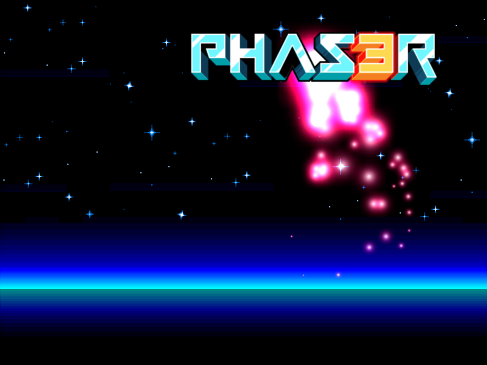

# Phaser.io Install

<iframe width="560" height="315" src="https://www.youtube.com/embed/HHsKBnSrTKE" frameborder="0" allow="accelerometer; autoplay; encrypted-media; gyroscope; picture-in-picture" allowfullscreen></iframe>

First, go to Phaser.io and download the library.  From there, know that you need a live server to make this work. You can get this as an add-on in Atom and in Visual Studio Code.  I won't run correctly otherwise.

## Live Server Instructions

[Live Server Instructions](http://phaser.io/tutorials/getting-started-phaser3/part2)


## Editor Choices

[Editors](http://phaser.io/tutorials/getting-started-phaser3/part3)

## Download Phaser.io

[Download the library](http://phaser.io/tutorials/getting-started-phaser3/part4)

## Assets

Don't forget to get the assets from GitHub

[Get the Assets](https://github.com/photonstorm/phaser3-examples)

[Assets for the walkthrough](https://github.com/Montana-Media-Arts/441-WebTech-Spring2019/tree/master/Week%2014%20Examples)
Put these directly in the assets folder.

## Create a "Hello World!" in Phaser.io

<iframe width="560" height="315" src="https://www.youtube.com/embed/xEvFkYvuZmI" frameborder="0" allow="accelerometer; autoplay; encrypted-media; gyroscope; picture-in-picture" allowfullscreen></iframe>

```html
<!DOCTYPE html>
<html>
<head>
    <script src="https://cdn.jsdelivr.net/npm/phaser@3.15.1/dist/phaser-arcade-physics.min.js"></script>
</head>
<body>

    <script>
    var config = {
        type: Phaser.AUTO,
        width: 800,
        height: 600,
        physics: {
            default: 'arcade',
            arcade: {
                gravity: { y: 200 }
            }
        },
        scene: {
            preload: preload,
            create: create
        }
    };

    var game = new Phaser.Game(config);

    function preload ()
    {
        this.load.setBaseURL('http://labs.phaser.io');

        this.load.image('sky', 'assets/skies/space3.png');
        this.load.image('logo', 'assets/sprites/phaser3-logo.png');
        this.load.image('red', 'assets/particles/red.png');
    }

    function create ()
    {
        this.add.image(400, 300, 'sky');

        var particles = this.add.particles('red');

        var emitter = particles.createEmitter({
            speed: 100,
            scale: { start: 1, end: 0 },
            blendMode: 'ADD'
        });

        var logo = this.physics.add.image(400, 100, 'logo');

        logo.setVelocity(100, 200);
        logo.setBounce(1, 1);
        logo.setCollideWorldBounds(true);

        emitter.startFollow(logo);
    }
    </script>

</body>
</html>
```

This is what it should look like

